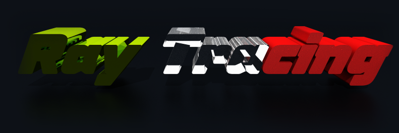
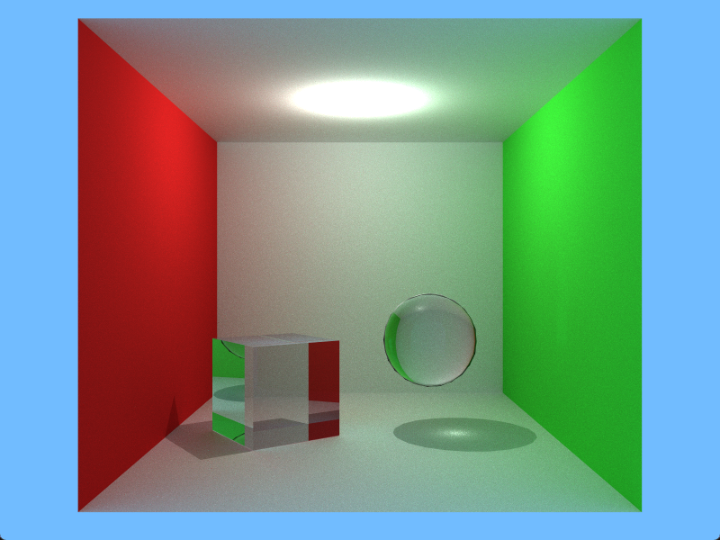

<div style="position: relative">
    
    <p style="position: absolute; top: 60%">
        This project is a custom GPU-accelerated **path tracer** written from scratch. It features physically based lighting, GGX microfacet shading, and full dielectric reflection/refraction with Fresnel. The entire renderer is built around **iterative ray tracing**, **compute shaders**, and a **BVH acceleration structure** for high performance.
        <br>
        <br>
        It also includes GLTF scene loading with support for switching between multiple scenes, a toggle to seamlessly switch between realtime rasterized mode and path-traced mode, and a built-in rendering mode to export renders as a **MP4** file
    </p>
</div>

## Key Features
### &nbsp;&nbsp;Physically-based path tracing
- Multiple bounce global illumination
- GGX microfacet shading
- Schlick Fresnel and Smith masking-shadowing

### &nbsp;&nbsp;Dielectris / Glass
- Reflection + refraction vis Snell's Law
- Proper Fresnel splitting
- Total internal reflection
- Accurate bright rims at grazing angles

### &nbsp;&nbsp;Materials
- Diffuse
- Metals
- Roughness
- Transmission
- Normal Maps
- IOR

### &nbsp;&nbsp;Scene & Geometry
- GLTF loading

### &nbsp;&nbsp;Performance
- Hundreds/Thousands of rays per pixel
- GPU compute shader acceleration
- Spatial acceleration structure (BVH with SAH)

<br><hr><br>

### Tech Stats
- **C++**
- **OpenGL** (GLFW, Glad, GLM)
- **Compute Shaders**
<br>
<br>
### How to play
1. Clone the repo
    ```bash
    Git clone https://github.com/bspafford/Raytracing
2. Open ```Build``` Folder
3. Run ```Raytracing.exe```

;